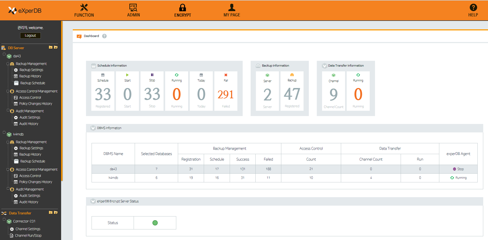

## Introduction
This page is test for github... 

## Features
* readme test
* License test
* Copyright test
* etc...

## TODO
* Community Test
* and so on...

## License
ltr/LICENSE

## Installation
1. Requirements
- github account

2. Configuration
- click the EDIT Button..

## Copyright
Copyright (c) 2016-2017, eXperDB Development Team
All rights reserved.

## Community
* https://www.facebook.com/experdb
* http://www.k4m.com

