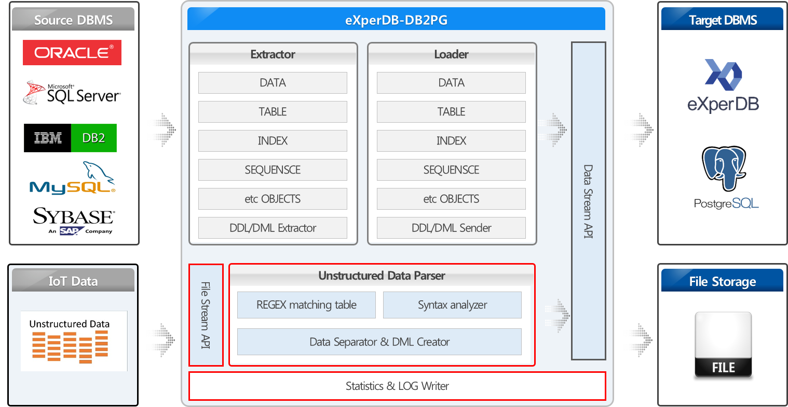

### Examples(On Linux)
Help                    ./db2pg.sh
Execute                 ./db2pg.sh -c db2pg.config
Create Import Log file  psql -U _user_name_ -d _database_name_ -p _port_ -h _host_ -f _filename.sql_ > import.log
Import Log Summary      ./db2pg.sh --unload-summary ./db2pg-result/import.log
Create Rebuild log file psql -U db2pg -d db2pg -p 5432 -h 127.0.0.1 -f fk_drop.sql > rebuild.log
                        psql -U db2pg -d db2pg -p 5432 -h 127.0.0.1 -f idx_drop.sql >> rebuild.log
                        psql -U db2pg -d db2pg -p 5432 -h 127.0.0.1 -f idx_create.sql >> rebuild.log
                        psql -U db2pg -d db2pg -p 5432 -h 127.0.0.1 -f fk_create.sql >> rebuild.log
Rebuild Log Summary     bash db2pg.sh --rebuild-summary ./db2pg-result/rebuild/rebuild.log

## Options
|Option|Description|Mandatory Status|Comment|
|----------|--------|:----:|----|
|-c, --config `<arg>`|Configuration file load for executing DB2PG command|O|In the current version(1.1.2), the environment setting is not input as a parameter.|
|-M, --make-templates|Create a configuration file to run the DB2PG command|X|
-|
|--rebuild-summary `<arg>`|Summarizes constraint execution logs such as PK, FK, INDEX created and deleted in Target Database|X|Create a file using '>' or '>>'|
|--unload-summary `<arg>`|Summarize the logs loaded on the target using the Import.sql script generated from the Source Database|X|Create a file using '>' or '>>'|
  

## Introduction
This page is test for github... 

## Features
* readme test
* License test
* Copyright test
* etc...

## TODO
* Community Test
* and so on...

## License

## Installation
1. Requirements
- github account

2. Configuration
- click the EDIT Button..

### Appendix 1. eXperDB-Transfer Installation and Configuration

## Copyright
Copyright (c) 2016-2017, eXperDB Development Team
All rights reserved.

## Community
* https://www.facebook.com/experdb
* http://www.k4m.com

